<div align="center">


# CookMate AI Meal Planner

**Local-first cooking assistant with 100 photo-rich recipes, smart weekly meal planning, dynamic shopping lists, and private Gemini AI assistance.**

[](https://expo.dev/)
[](https://reactnative.dev/)
[](https://www.typescriptlang.org/)
[](https://docs.expo.dev/versions/latest/sdk/sqlite/)
[](https://fastify.dev/)
[](scripts/build/evidence/)
[](LICENSE)

[Why CookMate exists](#why-cookmate-exists) · [Quick demo](#quick-product-demo) · [Product journey](#product-journey) · [Architecture](#architecture) · [Monorepo layout](#monorepo-structure) · [What I engineered](#what-i-engineered) · [System capabilities](#system-capabilities) · [Verification & quality](#verification-and-quality-gates) · [Local development](#local-development)

</div>

---

## Overview

Most recipe and meal-planning apps fail home cooks in two ways: they trap personal data behind cloud subscriptions and loss of connectivity, or they glue unreliable AI onto raw prompts that hallucinate ingredient quantities, cooking times, and dietary safety.

**CookMate is engineered around an offline-first, evidence-grounded paradigm.** The phone holds the authoritative recipe catalogue, meal plans, favourite collections, private cooking notes, and shopping checklists in a local SQLite database. An optional, pairing-secured Node.js/Fastify AI gateway bridges the mobile client to Google Gemini using strict JSON Schema validation, providing grounded recipe recommendations and conversions without compromising privacy or basic utility when offline.

> [!IMPORTANT]
> **Local-First & Device-Authoritative:** All core cooking, search, favouriting, weekly scheduling, and grocery aggregation capabilities operate 100% offline on-device with zero network requests. The external AI gateway is an opt-in enhancement with fail-safe boundaries.

---

## Why CookMate exists

CookMate solves the daily friction of: **“What should I cook, when should I cook it, and what groceries do I need to buy?”**

1. **Grounded Recipe Truth:** Built over a curated dataset of 100 photo-rich recipes with 960 ingredients and 706 ordered instructions. Source recipes retain exact measures; missing data is surfaced honestly rather than fabricated.
2. **Deterministic Multi-Ingredient Search:** Filter simultaneously by category, cuisine, and multiple pantry ingredients with exact intersection matching and typo-tolerant suggestions.
3. **Weekly Calendar Meal Scheduling:** Assign Breakfast, Lunch, and Dinner slots to calendar days without loss of past meal records.
4. **Intelligent Grocery Consolidation:** Automatically aggregate shopping list items from planned meals, merge quantities, group by aisle categories, and maintain manual additions and checked status.
5. **Private AI Gateway with Schema Guarantees:** Model proposals (substitutions, meal suggestions) must validate against Ajv JSON Schemas and pass explicit user review before modifying on-device state.

---

## Evidence at a glance

| Metric | Bounded verification evidence |
| :--- | :--- |
| **Curated Recipe Catalogue** | **100 complete recipes** with high-resolution photography, categorized across 12 cuisines and dietary tags |
| **Structured Dataset Records** | **960 verified ingredients** and **706 numbered instructional passages** (with 124 section headers) |
| **Automated Test Suite** | **986 passing automated tests** across contracts, catalogue, domain logic, gateway, and React Native component harnesses |
| **On-Device Database** | **SQLite local-first engine** with schema migrations, transactional integrity, and zero cloud lock-in |
| **AI Validation Boundary** | **Strict Ajv runtime validation** ensuring every Gemini response satisfies typed domain contracts |
| **Mobile Architecture** | **Expo SDK 57 / React Native 0.86** with TypeScript strict mode, responsive 320–428pt viewports, and dark mode |

---

## Quick product demo

<div align="center">
  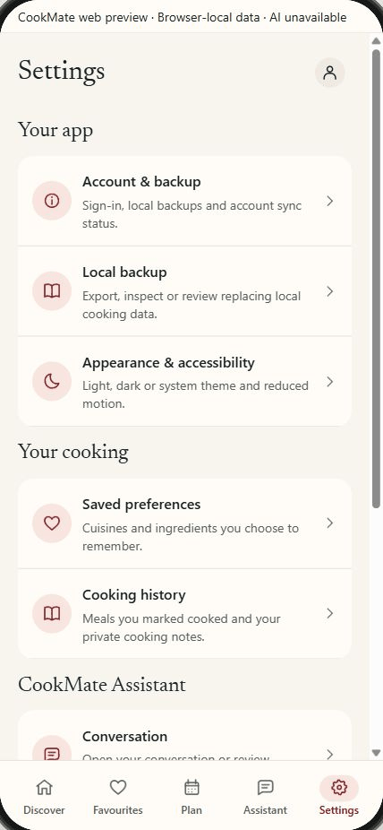
  <br /><br />
  <p><strong>Mobile interaction demo:</strong> Curated discovery, high-resolution recipe cards, multi-ingredient filtering, and responsive transitions on a 428 × 926 mobile viewport.</p>
</div>

---

## Product journey

These captures show the actual application running on the 428 × 926 mobile viewport across its core workflows:

<table>
  <tr>
    <td width="50%" valign="top">
      <strong>01: Discover & Browse 100 Recipes</strong><br /><br />
      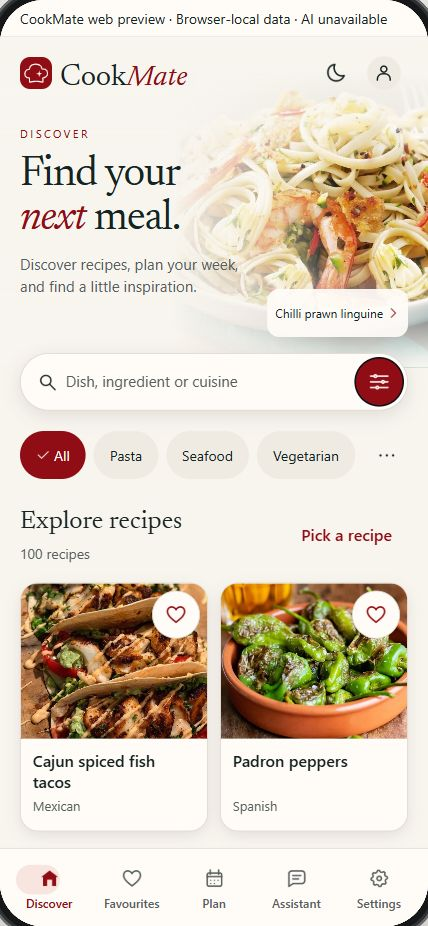
      <p>Clean editorial discovery featuring photo-rich recipe cards, fast category chips, and instant search entry.</p>
    </td>
    <td width="50%" valign="top">
      <strong>02: Multi-Ingredient Intersection Filtering</strong><br /><br />
      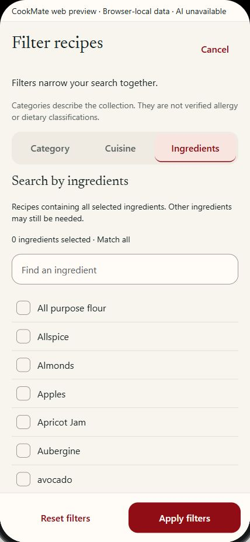
      <p>Filter by specific pantry items with strict "Match all selected ingredients" intersection logic and instant count updates.</p>
    </td>
  </tr>
  <tr>
    <td width="50%" valign="top">
      <strong>03: Grounded Recipe Details & Quantities</strong><br /><br />
      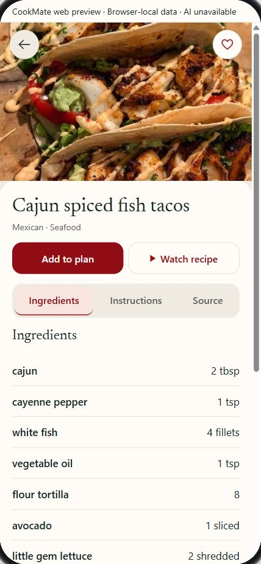
      <p>Detailed view with exact ingredient amounts, provenance links, video button, and direct "Add to plan" action.</p>
    </td>
    <td width="50%" valign="top">
      <strong>04: Distraction-Free Cooking View</strong><br /><br />
      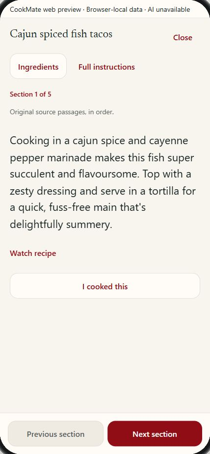
      <p>Focused cooking reader with large typography, step-by-step passage progression, and embedded ingredient quick-sheet.</p>
    </td>
  </tr>
  <tr>
    <td width="50%" valign="top">
      <strong>05: Weekly Meal Calendar & Slotting</strong><br /><br />
      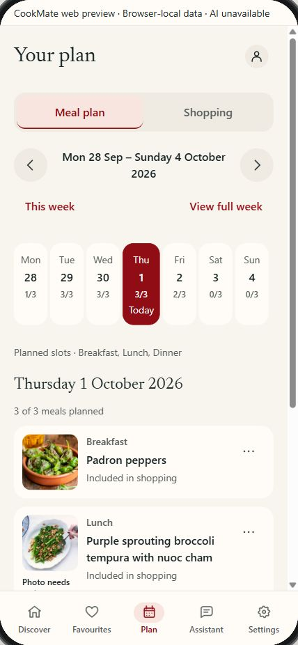
      <p>7-day calendar view organizing Breakfast, Lunch, and Dinner slots with conflict guards and consequence reviews.</p>
    </td>
    <td width="50%" valign="top">
      <strong>06: Dynamic Grocery Shopping Checklist</strong><br /><br />
      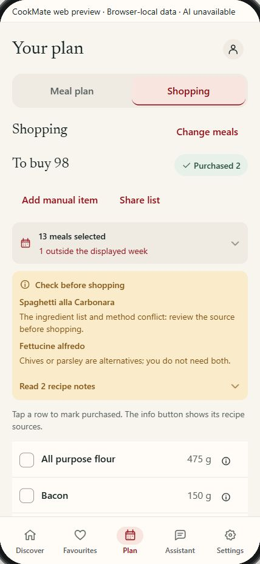
      <p>Automatic ingredient aggregation from selected meals, merged quantities, manual item additions, and checked state.</p>
    </td>
  </tr>
  <tr>
    <td width="50%" valign="top">
      <strong>07: Dark Mode · Discover Home</strong><br /><br />
      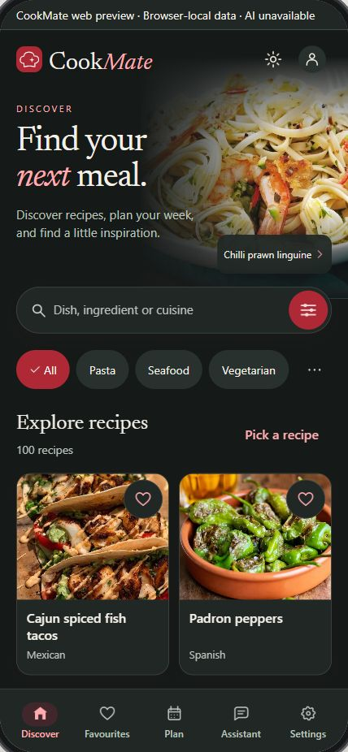
      <p>Warm dark-mode theme designed for comfortable evening kitchen usage, fully compliant with WCAG AA contrast standards.</p>
    </td>
    <td width="50%" valign="top">
      <strong>08: Dark Mode · Recipe Details</strong><br /><br />
      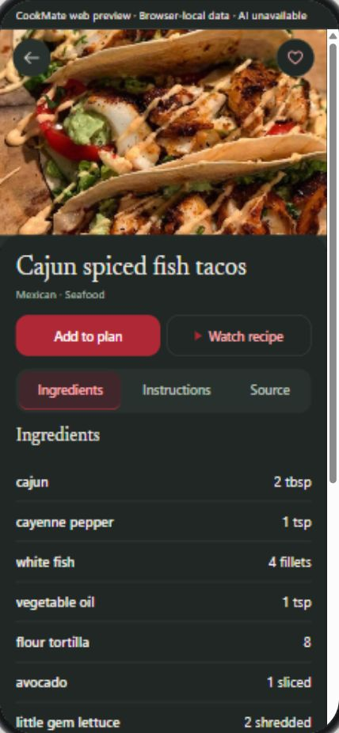
      <p>High-contrast dark presentation preserving authentic food imagery and legible typography across all components.</p>
    </td>
  </tr>
</table>

---

## Architecture

<div align="center">
  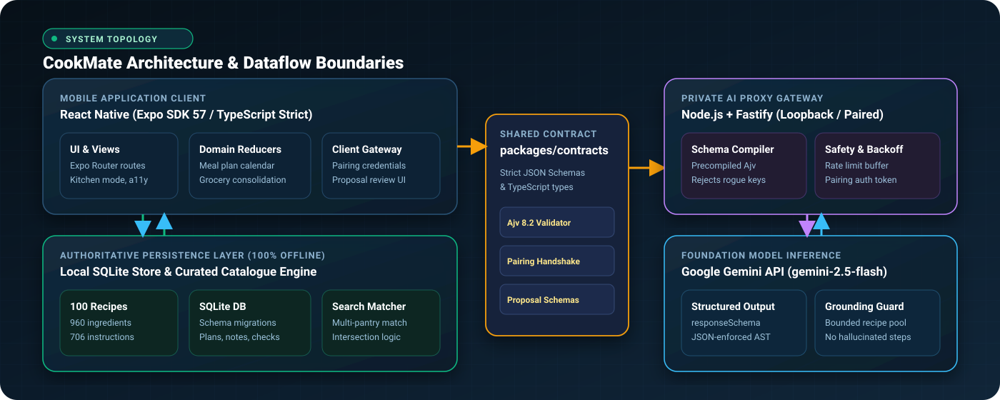
</div>

### Six Core Reliability Invariants

CookMate is engineered around six non-negotiable guarantees:

1. **On-Device SQLite is Authoritative:** The user's device holds the ground truth. Recipes, weekly meal plans, pantry ingredients, shopping checklists, and kitchen notes live in a local SQLite database. No external cloud service can alter or lock this data.
2. **Deterministic Multi-Ingredient Matching:** Pantry ingredient filtering executes strict mathematical set intersections on-device (`A ∩ B ∩ C`). No black-box AI ranking or fuzzy hallucinations decide what meals you can make with your pantry.
3. **Unidirectional AI Proposal Gate:** Upstream Gemini recommendations cannot mutate local state directly. The AI gateway emits strongly typed JSON proposal payloads that require explicit human review and confirmation before modifying the database.
4. **Precompiled Schema Compilation:** The private Fastify gateway enforces strict Ajv 8.2 JSON Schemas on all model outputs. Responses with unknown fields, malformed types, or invalid ingredient structures are immediately rejected.
5. **Fail-Safe Offline Continuity:** Network failures, gateway downtime, or upstream API rate limits cause zero degradation to local features. All 100 recipes, filters, step-by-step cooking mode, weekly planner, and shopping lists remain 100% usable without an internet connection.
6. **Curated Culinary Grounding:** The 100-recipe dataset contains 960 verified ingredients and 706 ordered instructions. Measurements, times, and steps are curated from authentic culinary sources rather than synthetic approximations.

---

## Monorepo structure

```
cookmate-app/
├── apps/
│   ├── mobile/             # React Native (Expo SDK 57) mobile client
│   │   ├── src/
│   │   │   ├── app/        # Expo Router file-based routes
│   │   │   ├── components/ # Atomic UI components, kitchen cards, lists
│   │   │   ├── design/     # Design tokens, typography, dark/light themes
│   │   │   ├── services/   # Local SQLite services, search engine, storage
│   │   │   └── hooks/      # State hooks for plans, shopping, favourites
│   │   └── assets/         # App icons, SVG vectors, typography
│   ├── gateway/            # Node.js + Fastify private AI gateway for Gemini
│   ├── admin/              # No-code recipe dataset & content manager
│   └── account-service/    # Optional local sync and backup adapter
├── packages/
│   ├── contracts/          # Shared JSON Schemas & TypeScript interfaces
│   ├── domain/             # Pure domain models (recipes, ingredients, plans)
│   ├── catalogue/          # Curated 100-recipe dataset & indexer
│   └── account-sync/       # Backup serialization & migration utilities
└── docs/
    └── media/              # Visual assets, screenshots, and diagrams
```

---

## What I engineered

- **Local-First Search & Multi-Ingredient Matcher:** Implemented normalized substring and token-based search with support for multi-ingredient intersection ("match ALL selected ingredients"), fuzzy spelling fallbacks, and cuisine aliases.
- **Weekly Meal Planner & State Machine:** Built calendar-aware meal slotting (Breakfast, Lunch, Dinner) supporting drag-and-drop, date navigation, historical retention, and quick-add to shopping.
- **Dynamic Grocery Aggregation Engine:** Designed algorithm to parse, normalize, and sum fractional ingredient measurements across selected meals, grouping by department/aisle with manual override support.
- **Strict Fastify AI Gateway:** Built a decoupled backend service interfacing with Google Gemini using pinned model parameters, strict structured output validation (Ajv 8.2), and rate-limit backoff.
- **No-Code Recipe Admin Tooling:** Created administrative scripts and UI for auditing recipe workbook integrity, verifying photo hashes, and validating instruction steps.
- **Comprehensive Quality Harness:** Established 986 unit and integration test assertions across packages, testing domain boundaries, database migrations, and component rendering without fragile network mocks.

---

## System capabilities

| Feature | Details |
| :--- | :--- |
| **Recipe Discovery** | Instant local search, 12 cuisines, dietary tags, cooking time, and ingredient filters |
| **Cooking Mode** | Large-format typography, step-by-step passage highlighting, keep-screen-on |
| **Meal Planning** | 7-day calendar view, breakfast/lunch/dinner slots, duplicate to next week |
| **Shopping Lists** | Auto-calculated from meal plan, checklist toggles, custom item additions |
| **Favourites & Notes** | One-tap bookmarking, custom cooking annotations, personal tweaks |
| **AI Meal Assistant** | Conversational recommendations based on available pantry items and dietary rules |
| **Theming & A11y** | Complete Dark Mode and Light Mode support, WCAG AA contrast compliance |

---

## Verification and quality gates

The project maintains a rigorous, reproducible test suite:

| Test Suite | Package / Scope | What is Verified |
| :--- | :--- | :--- |
| **`test:contracts`** | `packages/contracts` | JSON Schema compilation, schema drift prevention, TypeScript interface sync |
| **`test:catalogue`** | `packages/catalogue` | 100 recipe definitions, 960 ingredient records, image hashes, passage ordering |
| **`test:domain`** | `packages/domain` | Multi-ingredient set intersections, weekly calendar scheduling, grocery aggregator math |
| **`test:gateway`** | `apps/gateway` | Fastify endpoint handlers, Ajv runtime validator, pairing auth tokens, backoff |
| **`test:mobile`** | `apps/mobile` | React Native component rendering, Expo Router stacks, Dark/Light theme tokens, WCAG AA a11y |
| **Total** | **Full Monorepo** | **986 automated assertions passing with zero flaky network mocks** |

```powershell
# Run all workspace test suites sequentially
npm test

# Run individual package suites
npm run test:contracts     # JSON schema compilation & type drift checks
npm run test:catalogue     # Recipe dataset integrity & photo validation
npm run test:domain        # Core business rules, planner, and shopping math
npm run test:gateway       # Fastify AI gateway endpoints & Ajv validation
npm run test:mobile        # React Native component & navigation harness

# Run type checks across monorepo
npm run typecheck

# Verify build foundation
npm run verify:foundation
```

### Interactive Browser Preview

To inspect the responsive mobile interface without installing mobile simulators:
1. Open [`apps/mobile/public/iphone-preview.html`](apps/mobile/public/iphone-preview.html) in any browser.
2. Select between viewport scaling modes (100%, 75%, 50%, or auto-fit).
3. Test layout responsiveness and theme switching directly.

---

## Local development

### Prerequisites
- **Node.js**: `24.x`
- **npm**: `11.20.0` (pinned via `packageManager`)
- **Expo Go** or an iOS/Android Simulator

### Setup

```bash
# 1. Clone the repository
git clone https://github.com/Hasan-Al-Hussein/cookmate.git
cd cookmate

# 2. Install pinned workspace dependencies
npm ci

# 3. Start the mobile app
cd apps/mobile
npm run start
```

### Starting the AI Gateway (Optional)
```bash
# Set your Gemini API key in local environment
export GEMINI_API_KEY="your-gemini-api-key"

# Start the Fastify gateway
cd apps/gateway
npm run dev
```

---

## License

This project is licensed under the [MIT License](LICENSE).
